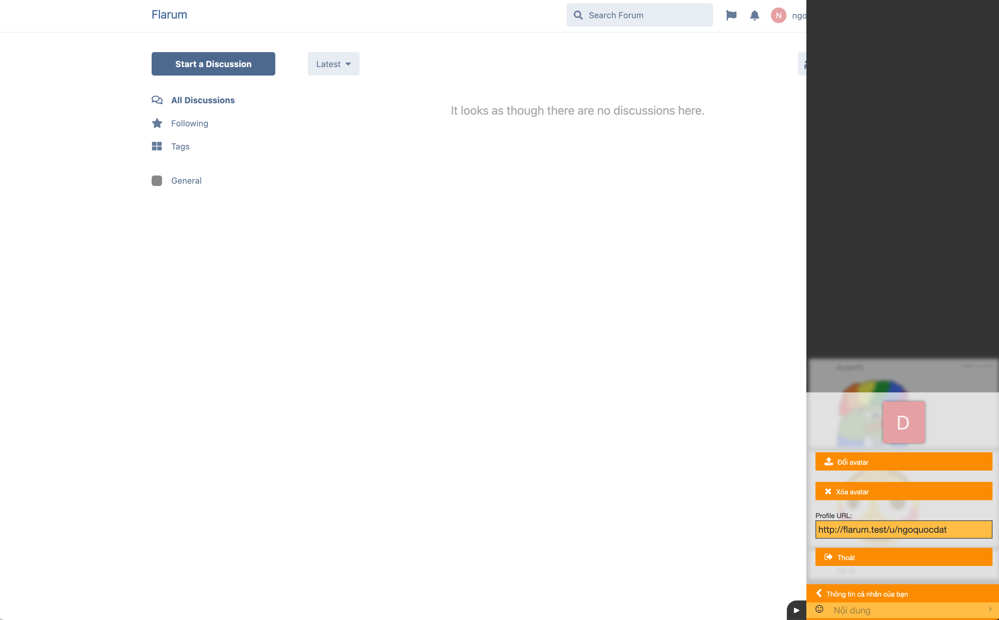

# Cbox

 [](https://packagist.org/packages/datlechin/flarum-cbox) [](https://packagist.org/packages/datlechin/flarum-cbox)

A [Flarum](http://flarum.org) extension to integrate Cbox with Flarum.

With [Cbox](https://www.cbox.ws) Integration, you can use Cbox Integration to achieve single sign-on. Users can log in or identify once with your site, and not have to enter their names again to post in your Cbox.



## Installation

Install with composer:

```sh
composer require datlechin/flarum-cbox:"*"
```

## Configuration

1. **Get Cbox Pro**: Ensure you have the Pro version of Cbox.
2. **Enable Integration**: In Cbox, go to **Users** -> **User Integration** to get your Secret, Box ID, and Box Tag.
3. **Configure in Flarum**: Enter the obtained details in the Cbox extension settings in Flarum.

## Updating

```sh
composer update datlechin/flarum-cbox:"*"
php flarum cache:clear
```

## Links

- [Packagist](https://packagist.org/packages/datlechin/flarum-cbox)
- [GitHub](https://github.com/datlechin/flarum-cbox)
- [Discuss](https://discuss.flarum.org/d/35127)
